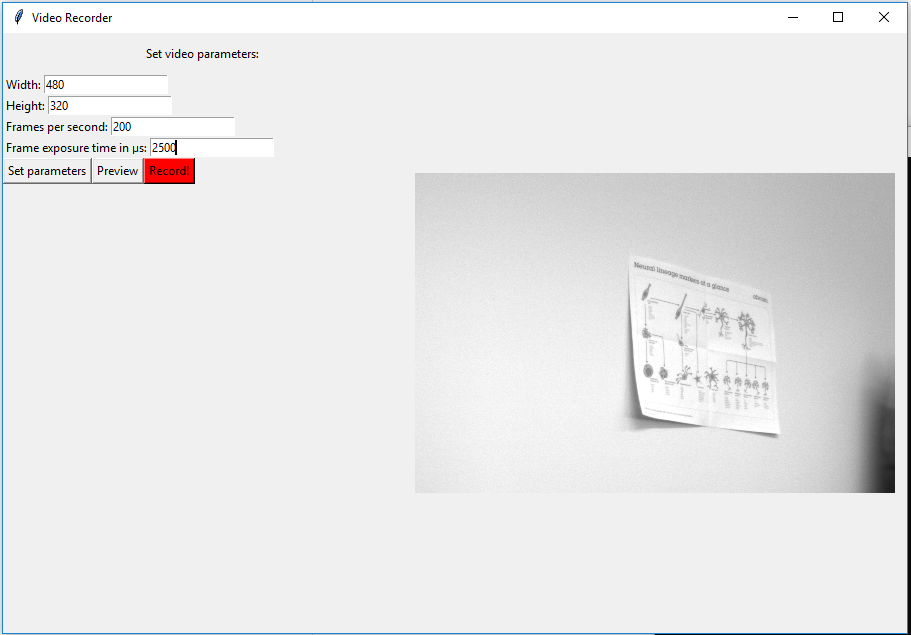
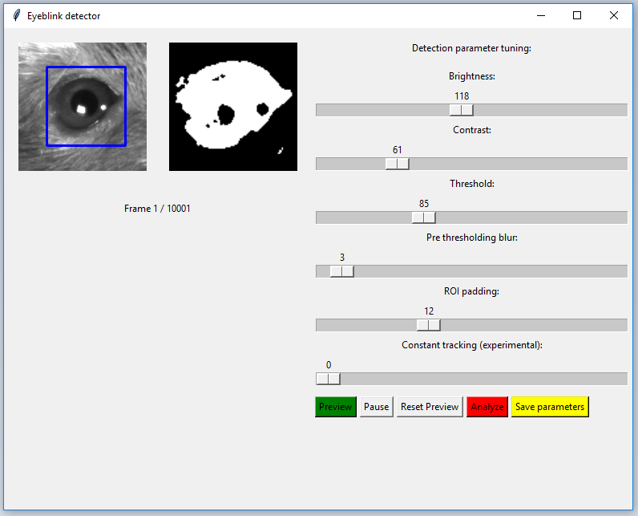

# Blinky - Eyeblink detector and tracker with recorder

Rodent eyeblink detector for classical eyeblink conditioning. Used for high speed videos captured from Basler's acA640-750um. Contains custom video recorder for Basler USB-cameras (may work with others too) made with PyPylon. Image processing done with OpenCV and GUI with python's Tkinter.

Note: Program is at initial prototype state, but still usable.

## Features
### Eyeblink detector
- Detect eye with haar cascade. Cascade from human eye, but works well with animals too.
- Tracking eye of the moving animal (experimental)
- Frame Filtering (brightness, contrast, blur)
- Frame thresholding (binary image)
- Selects ROI area
- CSV-output for frame, time and white level from binarized frames
- Load and save parameters
- Command line interface
- Quick and dirty GUI

### Basler video recorder
- Set output file (avi)
- Select video compression via Video for Windows interface. Not tested with UNIX-like OS:s.
- Set Basler camera parameters (width, height, fps, exposure time)
- Preview camera output (still frame).
- Record

### Eyeblink detector
- Docstrings
- Save overwrite check/message
- Threading/multiprocessing for better performance
- Real-time plotting
- Peak detection (realtime)
- Rework to meet the MVC pattern requirements for better structure and maintainability
- Better GUI (code and ui)
- Refactoring and cleaning

### Basler video recorder
- Docstrings
- Threading/multiprocessing for better performance
- Rework to meet the MVC pattern requirements for better structure and maintainability
- Better GUI (code and ui)
- Video preview (instead of still frame)
- Refactoring and cleaning


## How to use:
### Install:
- Install Python 3 (Miniconda)
- Create Conda environment. if you wish.
- Activate environment..
- PIP install following packages:
  - numpy, opencv-python, opencv-contrib-python, Pillow, scikit-video
- In addition for video recorder install Basler Pylon SDK and pip pypylon

### Eyeblink detector
To run gui:
```
python blinky.py
```
To run cmd line see the help:
```
python blinky.py -help
```

## Video recorder
To run gui:
```
python record.py
```

## GUI examples:


